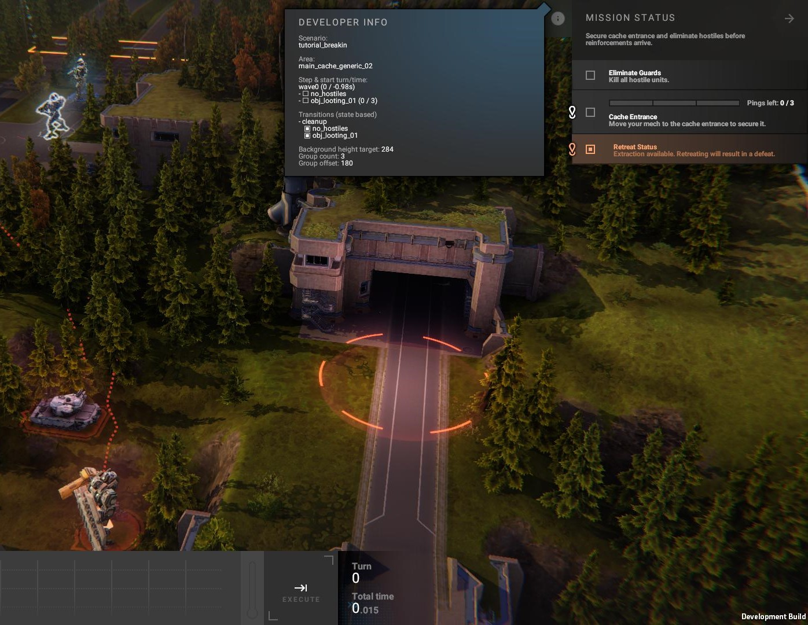
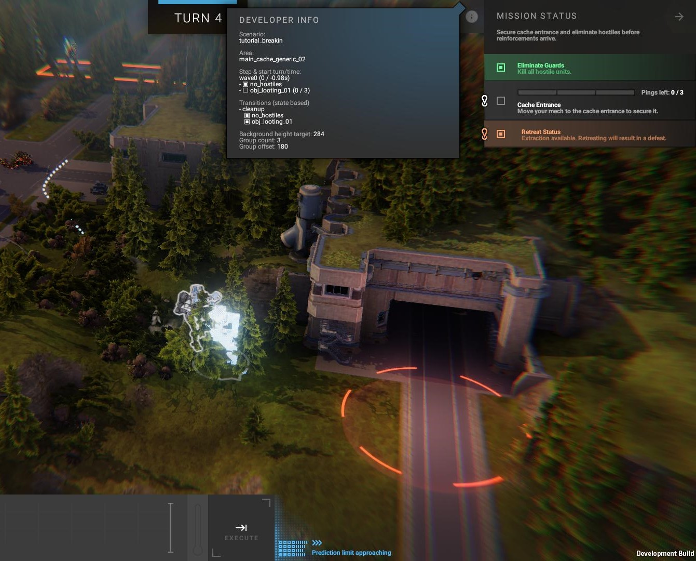
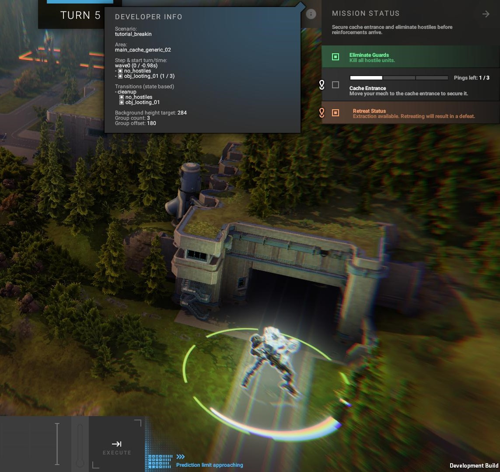
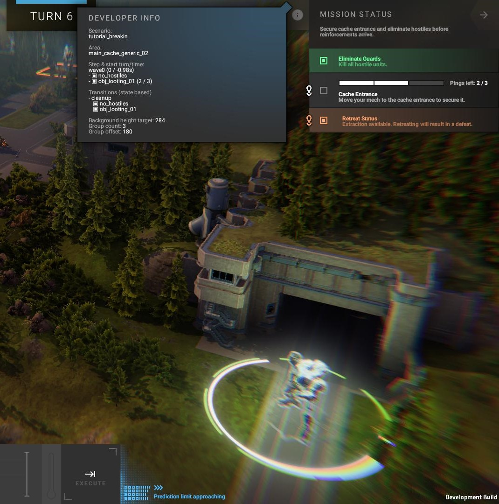
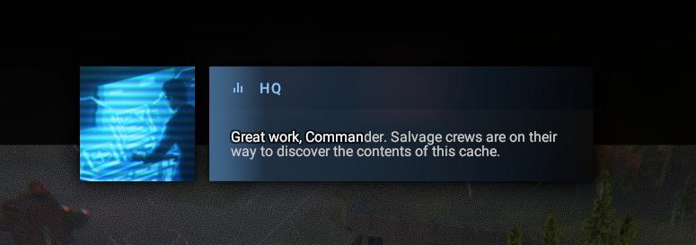
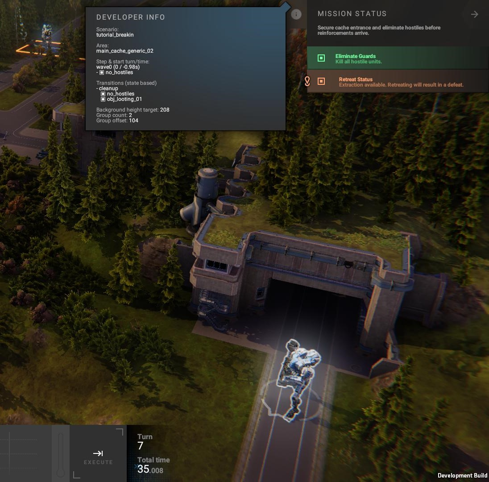
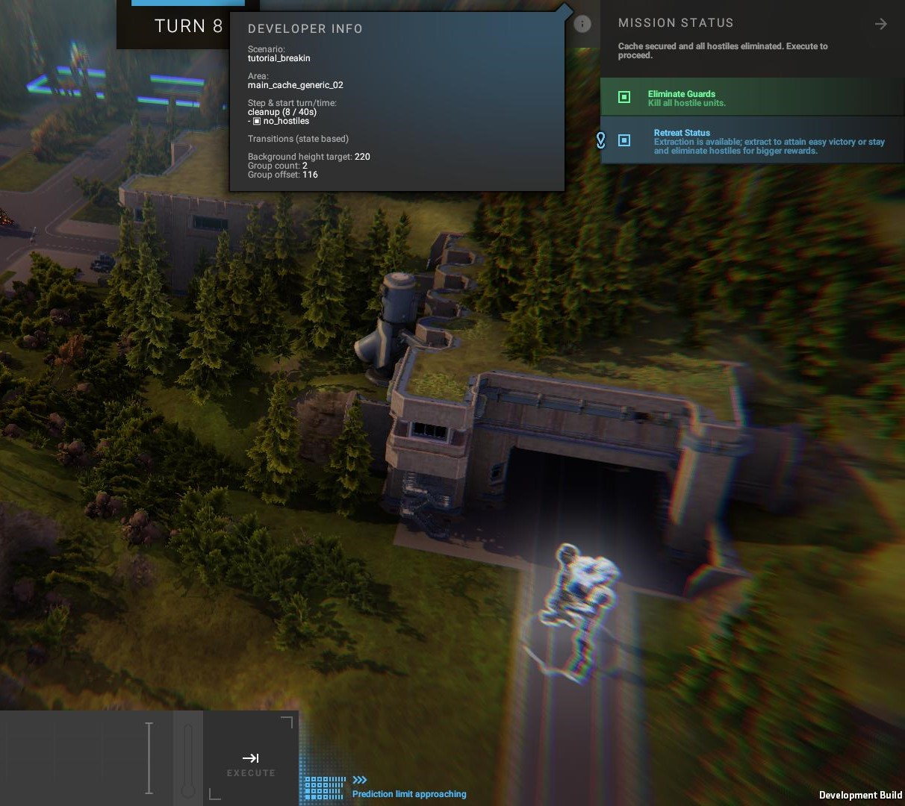
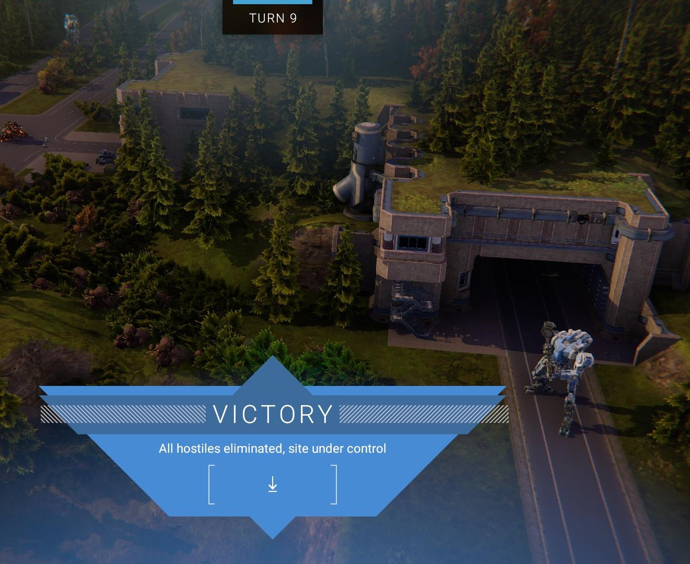

# ScenarioStateChange

**This mod is obsolete.** The game has been patched by the publisher so this bug is no longer present.

**UPDATE (2023-01-23):** this mod is not compatible with patch 0.23.1-b5426 released on 2023-01-19. Changes have been made to scenarios that alter how they work and I haven't finished my analysis of those changes.

A library mod for [Phantom Brigade (Alpha)](https://braceyourselfgames.com/phantom-brigade/) which demonstrates a fix for a bug in scenario processing. Specifically, in the combat scenario used for the Hidden Workshop Cache site in the second province, Ostbager-Wiel. Have you ever noticed that after you destroy all the guard units and wait around for 3 turns in the circle for the cache entrance, you have to wait around for another 2 rounds doing nothing before the scenario will end with victory? Well, I figured out what's going on and this mod patches the problem.

It is compatible with game patch **0.23.0-b5245**. That is an **EXPERIMENTAL** release. All library mods are fragile and susceptible to breakage whenever a new version is released.

This mod is principally for other modders who are writing their own scenarios. If you are using states with reactions that have a trigger limit greater than 1 and want to make a step transition when that limit is reached, the code in this mod will remove a corner case that may cause your scenario to linger around a turn or two before that transition happens.

There is more extensive information in the sections below.

- [Release Demo](#release-demo) : how to see the bug in the game and how this mod fixes it
- [Using the Fix](#using-the-fix) : incorporating the fix into your own mod
- [The Debug Trail](#the-debug-trail) : a short narrative of the bug illustrated with screenshots
- [Technical Notes](#technical-notes) : in-depth explanation of the code that processes scenarios and a behind-the-scenes look at how the bug happens

## Release Demo

To see the bug, do the following:

- Main menu > New Game > Quick Start
- Go to the Village site and complete the combat to reveal the Hidden Workshop Cache
- Go to the Hidden Workshop Cache site and start combat
- In combat, destroy all the guard units first; it doesn't matter if you kill them or just knock them out
- After destroying all the guard units, order one of your units to stand in the cache entrance circle for 3 turns

After waiting in the circle for 3 turns, a comms message will be displayed and you will be back in the planning phase. The circle will have disappeared showing that you have completed that objective. You will have to wait this turn and the _next_ turn before the scenario will end in Victory.

I have put together a release so you can see the fix in action. After you install the example mod from the release, run through the above steps again. This time you will see the scenario exit with Victory right after waiting 3 turns in the circle.

## Using the Fix

The best way to use this mod is to copy the code into your own mod. This is easiest if you already have a library mod but if not, create a library for your mod. Do not copy the code related to the `ModManager`. I have modified the method that processes ConfigEdit files so that it can handle deep paths and more value types (like enums) as well as expand YAML tags to objects but there's a subtle difference in behavior from the stock `ModManager` that may cause you problems. The `ModManager` code is there for the release demo.

You may have to do more than copy this code into your mod to fix the bug. There may be some changes you have to make to your scenario configurations as well. I've included ConfigEdit changes for two scenarios from the game -- `tutorial_breakin` and `generic_breakin` -- that are hit by this bug to show what might need changing in your scenario configurations.

## The Debug Trail

If you aren't sure what bug I'm talking about and are curious about what it looks like, this is a little picture book story of the problem.

I'm using the `tutorial_breakin` scenario as an example.

### Turn 0

We start with the opening turn in the scenario, Turn 0. All good programmers know that counting from zero is the proper way to do it, unlike what they teach you in kindergarten. You don't start a stopwatch for a race at 1, now do you?

There are a few things to notice here.

- I've hidden the replay button so you can see the turn number
- I have set `developerMode` to `true` in my debug.yaml settings file which enables the "DEVELOPER INFO" flyout that you see in the middle of the screenshot
- The section in the info flyout to keep an eye on is named "Step & start turn/time"; right now it shows the step is "wave0" with two states, "no_hostiles" and "obj_looting_01", that are false (empty boxes to the left of the state name)
- The "obj_looting_01" state has a count after it, telling us it's a state with a reaction that has a trigger count of 0 and a trigger limit of 3
- The "obj_looting_01" state is connected to the reddish circle in the middle and the status box in the upper right labeled "Cache Entrance"
- The cache entrance circle is a reddish color indicating that this state is false which corresponds with the empty box next to "obj_looting_01" in the info flyout
- The cache entrance status box has 3 thin rectangle segments filled in with a gray color
- The "Pings left" line in the cache entrance status box shows 0 of 3, again matching the trigger count/limit in the info flyout
- Both of the status boxes connected to the two states have dark gray backgrounds
- The retreat rectangle in the upper left is orangey; that means retreating now will end the scenario in Defeat
- The status box corresponding to the retreat status is a shade of orange and similar to the color of the retreat rectangle, this is another indicator that retreating now will end in Defeat
- The player units are in the upper left corner and the guard units are in the lower left corner

This is all to get you oriented to how things look at the start of this scenario.

After a short fire-fight with the guard units, they're vanquished and one of my units is ready to step into the cache entrance circle.

### Turn 4

This is the start of Turn 4.

If you're quick enough, you can capture the turn banner that's briefly shown between the end of the previous turn and the start of the planning phase for the next turn. Unfortunately, when the turn banner is shown, the time display next to the timeline is hidden. Just explaining why the turn number is in a different place.

What's important in this screenshot is that the step is still "wave0" and the "no_hostiles" state is now true. In the info flyout, the box to the left of the state name is filled and the matching status box is now green. The "obj_looting_01" state remains the same as in Turn 0. Retreat hasn't changed, either.

I order my unit to step into the cache entrance circle, hit EXECUTE and wait for the next turn.

### Turn 5

At the start of Turn 5, we see some interesting changes.

The cache entrance circle has turned green and there's a white arc on its inside edge. The status box is displaying one of the thin rectangle segments filled with white and the "Pings left" has updated to 1 of 3.

Looking at the info flyout, we see that the box for the "obj_looting_01" state is now filled and there trigger count has increased to 1. Here's the start of the problem.

The info flyout section labeled "Transitions (state based)" shows information about the next in the scenario and what's needed to move to that step. The next step is "cleanup" and it needs both the "no_hostiles" state and the "obj_looting_1" state to be true. Oddly, they're both true yet here we are, stuck in the "wave0" step.

Well, let's wait another turn and see what happens. I leave my unit in the circle and hit the EXECUTE button.

### Turn 6

At the start of Turn 6, if you didn't have the info flyout, you'd think everything was progressing on track.

The cache entrance circle is still green, the white arc inside is longer and another rectangle segment in the status box is white.

But we're still in step "wave0" with both states true. The transition to the "cleanup" step hasn't happened even though it appears all its requirements have been met.

OK, let's see what happens when we reach 3 pings. I leave my unit in the circle and hit EXECUTE.

### Turn 7

Argh, a comms message. This messes up my screen captures but on the bright side this is what's supposed to happen when we reach a trigger count of 3 for the "obj_looting_01" state.

Dismissing the comms message dumps us into the planning phase of Turn 7.

Your reaction upon seeing this screenshot should be, "Hey, wait a second! Shouldn't I be seeing the victory banner? I've completed all the objectives of this scenario."

The cache entrance circle is gone and so is the status box for the cache entrance. Even the "obj_looting_01" state is gone from the step section in the info flyout. But the scenario stays stubbornly in step "wave0". It must really like this step.

The retreat rectangle is still orangey so retreating right now, even though you've successfully completed all the objectives, will result in Defeat. There's nothing you can do but wait another turn if you want to leave with a Victory.

So I order my units to wait another turn.

### Turn 8

Turn 7 ends and Turn 8 starts and still, no Victory.

But look! In the upper left corner, you'll notice that the retreat rectangle has turned blue. Yay! We can get out of here with a Victory after all!

At the end of Turn 7, the step processing logic noticed that the "obj_looting_01" state had 3 of 3 pings and said, "OK, let's transition to cleanup." The "cleanup" step does nothing except allow the scenario to end in Victory. Oh, yeah, that's a dirty little secret about steps. They can decide if and with what outcome a scenario ends. Step "wave0" will let the scenario end in Defeat but won't let it end in Victory. The "cleanup" step doesn't care about Victory or Defeat, it's just there to boot you out.

OK, so you burned a turn doing some navel gazing but no biggie. The unit in the retreat zone can now retreat and the other unit, well, it's a bit far from the zone so it may take a few more turns to get there. Let's head out.

### Turn 9

The start of Turn 9 ... wait, _now_ it declares Victory?!?

## Technical Notes

To be sure, this is a minor bug but if you're writing your own scenarios it may be confusing for things not to happen when you expect them to happen. Scenarios are complex and modders aren't working with whatever tools the BYG devs have so we have to do things the hard way. You could waste an hour or more going over and over your scenario config YAML only to realize it's this bug.

There are actually a number of useful debugging features built into the shipped game code. Be sure to enable `developerMode` in your debug.yaml settings to see them. They'll often appear as flyouts on various UI objects and once you understand scenarios, you'll see they provide a load of useful information. For example, the developer info flyout in the combat view was tremendously helpful in isolating the factors in this bug.

### Steps and States

Scenarios are composed of two separate but interacting elements: steps and states. Steps are like waypoints in the scenario's storyline. They set the stage and then step aside. States keep track of what's happened in the scenario. States are independent of steps but can be associated with a step through the idea of scope. When steps start, they can bring states into scope or remove them from scope. This can be done directly through the `stateScopeChanges` attribute on a step or indirectly through the state requirements for state-based transitions. States can also bring other states into scope or remove them from scope. States can even automatically remove themselves from scope when they reach their trigger limits.

Only states in scope will be evaluated. Each state can have a set of conditions that are compared against properties in the combat environment, such as the current turn number, the count of Invader units still alive or a unit being in a particular location. If all the conditions are met, the value of the state is set to `true`; otherwise it's set to `false`. There's an additional wrinkle to states. They can do something more than just set a boolean value when their conditions are met. This is what the `reactions` attribute on a state is for. It is a map of integers to a set of different things a state can do. The integer keys of the map correspond to the trigger count of the state. Each time the conditions of the state are true, the trigger count increments. If there is a matching entry in the reactions map, that reaction is acted on.

These two concepts, steps and states, let you build some really elaborate scenarios. For example, the entire beginning tutorial is a single scenario, `unique_intro`, which covers everything from playing the cutscene videos and running the guided tour of the combat UI to staging the combat in the town. That's a lot of functionality and the YAML config file is pretty hefty, weighing in at nearly 3700 lines. The scenario I've been examining here, `tutorial_breakin`, has only two states and two steps but still is 268 lines of YAML. There's a cost to all this flexibility and it isn't just in the size of the config files. Obviously the code that processes scenarios is going to have some complexity to it as well.

### ECS (Entity Component System)

To understand the code, you need to be aware that the game uses an implementation of the ECS architecture called [Entitas](https://github.com/sschmid/Entitas). ECS stands for <emphasis>E</emphasis>ntities <emphasis>C</emphasis>omponents <emphasis>S</emphasis>ystems where data is stored in components that are grouped together in entities and operated on by systems. You can think of it in relational database terms where components are columns in a table, entities are rows in a table and systems are stored procedures. ECS is built for the sequential processing that is typical in games. Most games have a main loop that runs all the code to do the animation, render the graphics, play sounds and compute any motion or collisions of game objects. Unity stacks an eventing system on top of that loop and expects your game objects to implement various well-known callbacks. This lends itself very well to an object-oriented style of programming. As your game grows in size and complexity, however, this style can become confusing and in Unity, especially, it can be hard to know when which bits of your code will run. ECS is somewhat old school as it ditches the OO model and eventing system. Instead, your code is sliced up into functions and all data is stored globally. You explicitly set the order that your functions should be called and they'll be called in that order, one by one, on every iteration of the main loop. Your functions are what ECS calls systems and while all your data is stored globally, it is organized sort of like an in-memory database so it's not just a pile of variables. This is where it is helpful to think of components as columns and entities as rows. To get at your data, you pick a particular component of a specific entity much the same as you select a column from row in a table when using a relational database.

It may seem like a lot of work is being done unnecessarily if every system is being run on every iteration of the main loop. Maybe you have some systems that only need to be run only in specific circumstances. This is where the reactive systems from Entitas are useful. This is an extension that Entitas adds to ECS. It allows systems to be conditional and they're only run if those conditions are met.

### Systems

You may have guessed from my big lead-up that the scenario processing system uses reactive systems and you'd be right. There are five main systems for processing scenarios and they're all reactive systems. They are listed below in the order that they execute with the condition that triggers their execution:

- [`CombatScenarioTransitionSystem`](#combatscenariotransitionsystem) : `ScenarioTransitionRefresh` added
- [`CombatScenarioStateSystem`](#combatscenariostatesystem) : `ScenarioStateRefresh` added
- [`CombatScenarioStepActivationSystem`](#combatscenariostepactivationsystem) : `ScenarioStepCurrent` added
- [`CombatExecutionEndSystem`](#combatexecutionendsystem) : `Simulating` removed
- [`CombatScenarioConditionsSystem`](#combatscenarioconditionssystem) : `Simulating` removed

Both the order of execution and the triggering conditions are important factors in the bug. Each system works with the scenario in a slightly different way and they all coordinate to ensure progress through the scenario and its steps.

### CombatScenarioTransitionSystem

This system controls changing steps (step transition) when the current step has state-based transitions. There are different ways to determine if a step transition should be done and checking the values of the scenario's states is one of those ways. Hence the name state-based transition. A set of state requirements is consulted and if all the requirements are true, a step transition is scheduled. A state requirement is simply the expected value of a state. A state value is a boolean so it can only be either `true` or `false`. Except when the state has reactions with an expected value of `true` and a trigger limit greater than 1. In that case, the requirement is met only when the trigger count is equal to or greater than the trigger limit. It's this extra condition on state requirements that's the ultimate source of the bug.

As an aside, a state-based transition doesn't have to have any requirements. If it doesn't, the transition will happen unconditionally. Not that this is relevant for this bug, just FYI.

### CombatScenarioStateSystem

This system evaluates states that are in scope. It builds a list of states in scope then checks the conditions of each state in turn and sets the value of the state based on the results of the checks. This is the system that also triggers states. Again, only states in scope can be triggered. If the state is triggered, this system runs any reaction effects the state might have for that trigger count. This system will check the transition mode of the current step and if it is `OnStateChange`, it will schedule a transition check if any of the evaluated states changed value. Scheduling a transition check is different from scheduling a transition. A transition check adds the `ScenarioTransitionRefresh` to the combat context so that on the next iteration of the main loop the `CombatScenarioTransitionSystem` is triggered. Here's where an accomplice of the bug lives. The problem is that it is only the value of the state that is looked at, not the trigger count. What my fix does is schedule a transition check when either the state value changes _or_ the trigger count changes. This system doesn't need to know what it takes to fulfill a state requirement because it doesn't care about those. All it needs to know is what _might_ cause a step transition and let another system figure it out.

### CombatScenarioStepActivationSystem

As mentioned in the description of `CombatScenarioTransitionSystem`, if the current step has a state-based transition and all the state requirements are met, a step transition is scheduled. That is done by adding `ScenarioStepCurrent` to the combat context which triggers this system. This system loads the new step and goes through all of its attributes to change things in the combat environment. One of the powers of this system is to end the scenario if the step has an `outcome` attribute.

### CombatExecutionEndSystem

Like the name of this system says, it's triggered at the end of a turn, when the simulation phase ends. One of the first things it does is set ScenarioStateRefresh with a context of `OnExecutionEnd` which schedules `CombatScenarioStateSystem` to run on the next go around of the main loop. If the current step has a transition mode of `OnExecutionEnd`, it'll also schedule a transition check. One more thing it does is handle retreats. Retreats are another way to end a scenario. 

### CombatScenarioConditionsSystem

This system is triggered at the end of a turn, after the simulation phase has ended. The job of this system is to count up active units and decide the outcome of combat. The current step can block the operation of this system by not allowing outcomes of `Victory` or `Defeat`. If the current step blocks both types of outcomes, this system effectively does nothing.

### Transition Mode

One more piece of the bug that's important is that each scenario step has a transition mode. The purpose of the transition mode is to control when transition checks are scheduled. In the `tutorial_breakin` scenario where we can see this bug in action, both steps have a transition mode of `OnExecutionEnd`. If a step can end the scenario, it's probably a good idea to make sure the transition to that step happens only at execution end so the scenario doesn't exit in the middle of a turn.

### Example and Analysis

To see how all the parts fit together to create this bug, let's put ourselves in the `tutorial_breakin` scenario at the point where all the guard units have been destroyed, so the "no_hostiles" state is `true` and one of the player's units has been in the cache entrance circle for 2 turns. This means the "obj_looting_01" state is `true` and its trigger count is 2. The step, meanwhile, hasn't changed from the starting step of "wave0". The player just has to keep the unit in the circle for one more turn to complete that objective.

Assume the player does keep their unit in the circle for one more turn. At the end of the turn, `CombatExecutionEndSystem` will run and schedule state evaluation and a transition check because the transition mode of step "wave0" is `OnExecutionEnd`. `CombatScenarioConditionsSystem` also runs at the end of the turn, after `CombatExecutionEndSystem`, finding that all enemy units are inactive but is blocked from ending the scenario because the `allowOutcomeVictory` attribute on step "wave0" is `false`. The current iteration of the main loop finishes with no more scenario processing. On the next iteration of the main loop, the transition check runs first. It sees that the "no_hostiles" state and "obj_looting_01" states are both true and "obj_looting_01" has a trigger count of 2 but a trigger limit of 3 so the state requirements aren't satisfied and no step transition is scheduled. The state evaluation system runs next, sees that all the conditions for the "obj_looting_01" state are met and triggers the state. This increments the trigger count to 3 which matches a reactions effect. The effect displays a comms message and then removes the state from scope so it won't be evaluated any more. No more scenario processing happens until the player executes a turn.

What the player sees is that the cache entrance circle has disappeared but the scenario is still active. Retreat at this point will result in a scenario outcome of `Defeat` because the current step is still "wave0" and it has a `retreat` attribute of `Defeat`. There's nothing for the player to do but wait out this turn.

At the end of the turn, both `CombatExecutionEndSystem` and `CombatScenarioConditionsSystem` will run with the same result as the previous turn. However, this time `CombatScenarioTransitionSystem` will see that all the state requirements have been satisfied and will schedule a step transition. No states have changed so `CombatScenarioStateSystem` will do nothing of consequence. Because a step transition has been scheduled, `CombatScenarioStepActivationSystem` will run and switch the current step to "cleanup". This step has a transition mode of `OnExecutionEnd` so no more scenario processing will happen until the player executes yet another turn.

Step "cleanup" has two important differences from "wave0". It sets the `allowOutcomeVictory` to `true`. This allows `CombatScenarioConditionsSystem` to end the scenario with `Victory`. It also sets the retreat outcome to `Victory`.

What the player sees is the scenario continuing on for some reason but the retreat zone is now lit up with a blue rectangle. This gives them the idea that they can retreat to win. Most likely, though, at least one of their units is too far away to reach the retreat zone in this turn so they won't be able to extract all their units at once.

The player will execute the turn and it is at the end of this turn that the player will finally achieve the victory ending, even though they haven't retreated all of their units. This will be perplexing the first time a player experiences it. Some may shrug it off with a "huh, that's weird" but others may get frustrated because they won't be able to figure out what they did to trigger the ending. It just happens while one or more of their units is running for the retreat zone.

But we can now understand what's going on behind the scenes. At the end of the turn, `CombatScenarioConditionsSystem` will run with the same result as before, all enemy units inactive and some player units active, but this time it won't be blocked by the current step from ending the scenario with a `Victory` outcome.

### Fix

My fix has two parts.

1. Make `CombatScenarioStateSystem` schedule a transition check when the trigger count changes.
2. Change the transition mode of the "wave0" step to `OnStateChange` and populate the `outcome` attribute on step "cleanup" with a type of `Victory`.

Combined, these changes have the scenario ending in Victory as soon as the player reaches the third trigger of the "obj_looting_01" state. It does so by extending the chain of events to keep the scenario processing systems reacting long enough to finish out a sequence of successive state changes and step transitions. Without these changes, the processing stops early and requires the player to poke it by executing another turn.

If you have made it this far, congratulations! You have a lot of patience. I hope that you understand how scenarios work much better now. I know I've significantly improved my knowledge of what a scenario is and how the game uses them by debugging this seemingly insignificant and dismissable problem.
